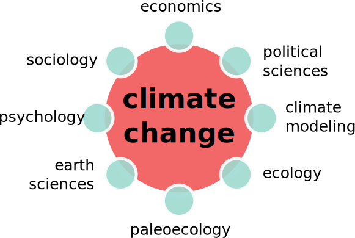
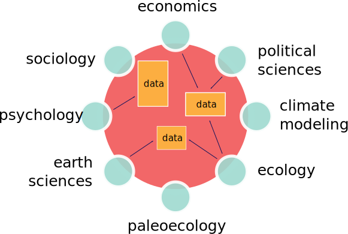

# Scientific Annotation
## Using Graphs to Facilitate Interdisciplinary Science

<p align=left><small>Data resources in the Earth Sciences range from kilobytes to terabytes, with a range of user communities, technical competence, and scientific uses. There is a need to increase usability and discoverability, to assign credit to data generators, developers and to provide people with the tools and knowledge they need to help address some of society's most pressing issues. This presentation showcases an approach that uses neo4j's graph database, open source APIs, the use of persistent identifiers such as ORCIDs and DOIs, and crowd sourcing to help connect disciplines within the Earth Sciences to undertake science for a new century.</small></p>

Simon Goring, Assistant Scientist<br>
University of Wisconsin - Madison<br>
<small><a href=goring.org>goring.org</a> - @sjgoring </small><br>
<small>tweet #odscwest</small>
<!--s-->

# Scientific Annotation
## Using Graphs to Facilitate Interdisciplinary Science

Simon Goring<br>
Steve Richard, Kirsten Lehnert, Doug Fils, Nick McKay, Steve Khuen, Anders Noren, Jack Williams<br>
<small>University of Wisconsin, Columbia University, Ocean Leadership, Northern Arizona University, Concord College, University of Minnesota</small>


<div>
  
  
</div>

<!--v-->

<div style="height:200px;width=100%">
  
  
</div>

<div style="height:100px;width=100%">
  
  
  
  
  
  
</div>

<!--s-->

## Wicked problems
<div>
  
  
</div>

<!--v-->

## Wicked problems
<div>
  
  
</div>

<!--v-->

<p align=left>All recognize metadata’s potential value, but when the rubber meets the road, an unfunded mandate to be altruistic . . . does not prove highly attractive. <strong>Introduced in order to reduce data friction, metadata creates its own kind of friction</strong>.</p>

<p align=right>Edwards et al. 2011. Social Studies of Science</p>


<!--s-->
<!-- .slide: data-background="./images/pls_oak_map.svg" -->

<div class="boxer">
<h1 align="left">Big Data in the Long Tail</h1>

<p align=left><strong>Situating Ecology as a Big-Data Science: Current Advances, Challenges, and Solutions</strong><br>
<small><em>Scott S. Farley, Andria Dawson, Simon J. Goring and John W. Williams</em><br>
<em>Bioscience</em> <strong>68</strong>:563–576. DOI: <a href="https://doi.org/10.1093/biosci/biy068">10.1093/biosci/biy068</a></small><br>
</p>
</div>

<!--v-->


## Axes of Big Data

Note: DJ Patil, former White House Science Advisor, indicated the wealth of data in the Earth Sciences available to data sciences, the challenge is that much of the data requires some level of disciplinary knowledge to analyse.

<!--v-->

## Community Curated Data Resources

<div style="display:inline-block;width:100%">
  
  
</div>

<p align=left>
<small><a href=https://doi.org/10.1017/9781108681582>Goring <em>et al.</em> (2018)</a>;
<a href=https://doi.org/10.1017/qua.2017.105>Williams <em>et al</em> (2017)</a>;
<a href=https://doi.org/10.1093/biosci/biy068>Farley <em>et al</em> (2017)</a></small>
</p>

<!--v-->

## Neotoma

<div style="height:400px" class="boxer">
  <div style="float:left;width:70%;display:inline-block;">
    
    
  </div>
  <div style="float:right;width:27%;display:inline;">
    
  </div>
</div>
<p align=right><small>Neotoma Paleoecology Database - <a href="http://neotomadb.org">neotoma.org</a></p>

Note: Ive been intimately involved in interdisciplinary research for most of my academic career.  I manage the Neotoma Paleoecology Database, a community curated data repository that manages records of fossils and environmental data covering the last 2.5 mya, developing tools in R to access this resource, writing scripts and helping build the pipeline to other tools, including the FlyoverCountry App, that puts the power of XXX geological data resurces into the hands of users.

<!--v-->

## Neotoma Database


<!--v-->

## Neotoma Data


<p align=left><small><a href=https://doi.org/10.1017/9781108681582>Goring et al. 2018. Elements of Paleontology</a></small></p>

Note: My research has focused on building models that relate climate and forest cover over the last 10,000 years, along with historical survey records, modern remote sensing data, real-time sensor data, data assimilation models and General Circulation models to help improve predictions of future climate using models of past vegetation and climate.

<!--v-->

## Community Curated Data Resources

<div style="height:400px;">
  
  <figure style="height:400px;border:none;">
    
    <figcaption style="border:none;"><small>Flyover Country Interface</small></figcaption>
  </figure>
<p align=left><small><a href=https://doi.org/10.1017/9781108681582>Goring et al. 2018. Elements of Paleontology</a></small></p>
</div>

<!--s-->

# Managing Variety


<!--v-->

# Managing Variety

*  Development and adoption of standards
  - <a href=http://schema.org>schema.org</a>, W3C
  - Khider et al. <a href=https://doi.org/10.1029/2019PA003632>2019</a>. Crowdsourced Reporting Standards for Paleoclimate Data.
*  Cross-resource collaboration
  - EarthLife Consortium, Flyover Country
*  Industry partnerships
  - Google Dataset Search/Project 418

<!--v-->

## Data Alignment


<!--v-->

## Data Alignment


<!--v-->

## Data Alignment

<object type="image/svg+xml" data="images/time_problem.svg" aria-label="An image shows how representations of time in a single project may differ. Climate data from PRISM is aggregated on monthly scales with no temporal uncertainty, historical data may pre-date daylight savings time, some data may only be resolved to annual scales, and pollen data often has a method-specific uncertainty, so that discrete time intervals are not represented." width="70%">
Your browser does not support SVG
</object>

Note:  Work by Stephen Richard and myself has shown how mapping variable definitions across open-science databases does indicate a level of apparent alignment between data resources (e.g., Temperature to Temperature), but in practice this alignment may be illusory.

<!--v-->

## Managing Veracity


<!--v-->
## Wicked Projects
<div>
  
  
</div>
<!--v-->

## Interdisciplinary Costs


Note: Within individual projects we also see inequity between early career researchers and established researchers.  Because of the structure of the academic reward system, it is the early career researchers who bear the burden of interdisciplinary research, while established researchers gain most of the benefits.  Reducing the "time to science" for early career researchers would allow them to gain rewards faster, and compete against researchers working within the more traditional disciplinary silo.

<!--v-->

## Data Alignment


<!--s-->

## Annotation Graphs

<!--v-->

## EarthCube and Throughput


Note: Introducing EarthCube & Throughput

<!--v-->

## Connecting Resources


<!--v-->

## Annotation Model


<!--v-->

## Annotation Model


<!--v-->
<!-- .slide: data-background="./images/geo_graph.svg" -->
<div class="boxer">
  <h2>GitHub Repositories</h2>

- 2301 Data Resources Catalogued
- 24,000 GitHub Repositories Linked
</div>

<!--v-->

## Connectivity


<!--v-->
<!-- .slide: data-background="./images/all_geo.svg" -->

<div class="boxer">
  <h2>Graph Algorithms</h2>

- Recommendation systems
- Pattern detection in coding
- Support for API development and data error detection

```r
results <- neotoma::get_datasets(
  bbox = c(-120, 30, -113, 60))

# data errors
drop_records = c(10, 12, 13, 14)
```

</div>

<!--v-->

## Deeper insights into patterns


<!--v-->

## Supporting Data Acquisition


<!--v-->

## Supporting Data Acquisition

<div class="boxer">
<p style="font-size:20px;text-justify:left;line-height:1;font-family:monospace;">{Quaternary Research 58 , 130 -- 138 ( 2002 ) doi :10.1006 / qres .2002.2353 Paleoenvironmental Changes in the Semiarid Coast of Chile ( ∼ 32 ◦ S ) during the Last 6200 cal Years Inferred from a Swamp -- Forest Pollen Record Antonio Maldonado1 and Carolina Villagra ´ n Laboratorio de Palinolog ´ ıa , Departamento de Biolog ´ ıa , Facultad de Ciencias , Universidad de Chile , Casilla 653 , Santiago , Chile E-mail : amaldona@icaro.dic.uchile.cl Received October 3 , 2001 ; published online August 22 , 2002 Pollen analysis of two sediment records from a coastal swamp forest site in the Chilean semiarid region ( 31 ◦ 50 S ; 71 ◦ 28 W ) shows an alternation of dry and wet phases during the past ∼ 6100 cal yr B.P. .}</p>
</div>

<!--v-->

## Supporting Data Acquisition

<div class="boxer" style="width:100%;height:400px;">
  <div style="float:left;display:inline-block;width:60%"><p style="font-size:20px;text-justify:left;line-height:1;font-family:monospace;">{Quaternary Research 58 , 130 -- 138 ( 2002 ) doi :10.1006 / qres .2002.2353 Paleoenvironmental Changes in the Semiarid Coast of Chile ( ∼ 32 ◦ S ) during the Last 6200 cal Years Inferred from a Swamp -- Forest Pollen Record Antonio Maldonado1 and Carolina Villagra ´ n Laboratorio de Palinolog ´ ıa , Departamento de Biolog ´ ıa , Facultad de Ciencias , Universidad de Chile , Casilla 653 , Santiago , Chile E-mail : amaldona@icaro.dic.uchile.cl Received October 3 , 2001 ; published online August 22 , 2002 <strong>Pollen analysis</strong> of two sediment records from a coastal swamp forest site in the Chilean semiarid region <strong>( 31 ◦ 50 S ; 71 ◦ 28 W )</strong> shows an alternation of dry and wet phases during the past ∼ 6100 cal yr B.P. .}</p>
  </div>
  
</div>
<!--v-->

## Supporting Data Acquisition


<!--s-->
## Development

* Entering Year 1 of a 3 year funding cycle
* <a>http://github.com/throughput-ec</a>
  - node.js/Express API
  - database ingest scripts
  - metrics and presentations
  - MIT License, Codes of Contributor Conduct
  - DB Snapshot: <a>http://bit.ly/throughput-shot</a>

<!--v-->

## Questions

<p class="hangingindent">
Farley S, Dawson A, Goring SJ, Williams JW. <em>2018</em>. Situating ecology as a big data science:  Current advances, challenges, and solutions. <em>BioScience</em>. <b>68</b>:563–576. DOI: <a href="https://doi.org/10.1093/biosci/biy068">10.1093/biosci/biy068</a></p>

<p class="hangingindent">
Williams JW, Goring SJ, Emile-Geay J, Fils D, Grimm EC, Lehnert K, McKay N, Myrbo A, Noren A, Park-Boush L, Peters S, Singer B, Uhen M. 2018. Cyberinfrastructure in the Paleosciences: Mobilizing Long-Tail Data, Building Distributed Community Infrastructure, Empowering Individual Geoscientists. <a href=https://www.authorea.com/users/152134/articles/165940-cyberinfrastructure-in-the-paleosciences-mobilizing-long-tail-data-building-distributed-community-infrastructure-empowering-individual-geoscientists>Open Access</a></p>

<p class="hangingindent">
Goring SJ, Graham R, Loeffler S, Myrbo A, Oliver JS, Ormond C, & Williams JW. 2018. <em>The Neotoma Paleoecology Database: A Research Outreach Nexus</em>. Elements of Paleontology. Cambridge: Cambridge University Press. [DOI: <a href=" https://doi.org/10.1017/9781108681582">10.1017/9781108681582</a>]
</p>

<p class="hangingindent">Goring S, Weathers K, Dodds W, Cheruvelil K, Kominoski J, Rüegg J, Sweet L, Utz R. (2014) The collaborative culture of Macrosystems Ecology: Optimizing participant benefits. <em>Frontiers in Ecology and the Environment</em>. <b>12</b>:39-47. [<a href="http://dx.doi.org/10.1890/120370">Open Access</a>]</p>


@sjgoring
<a>http://goring.org</a>
